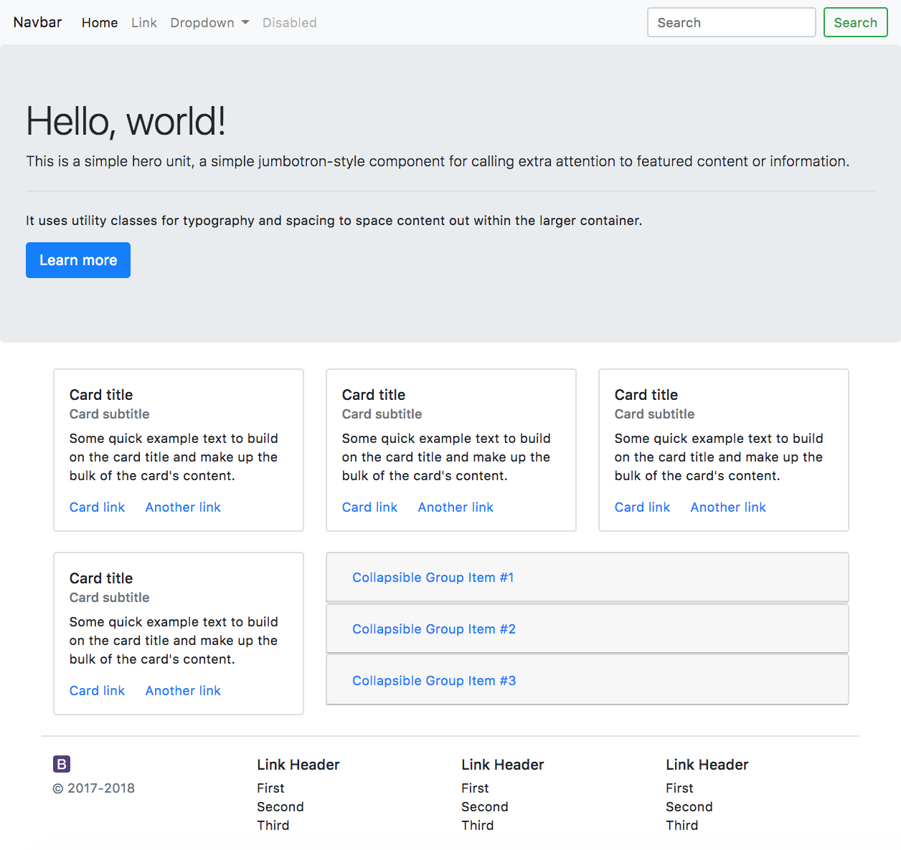
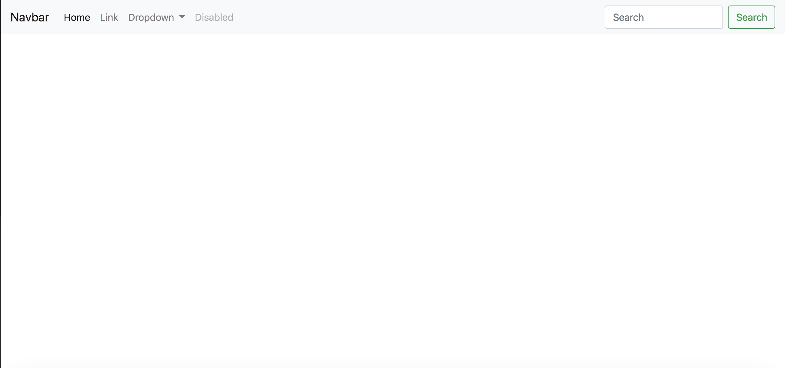
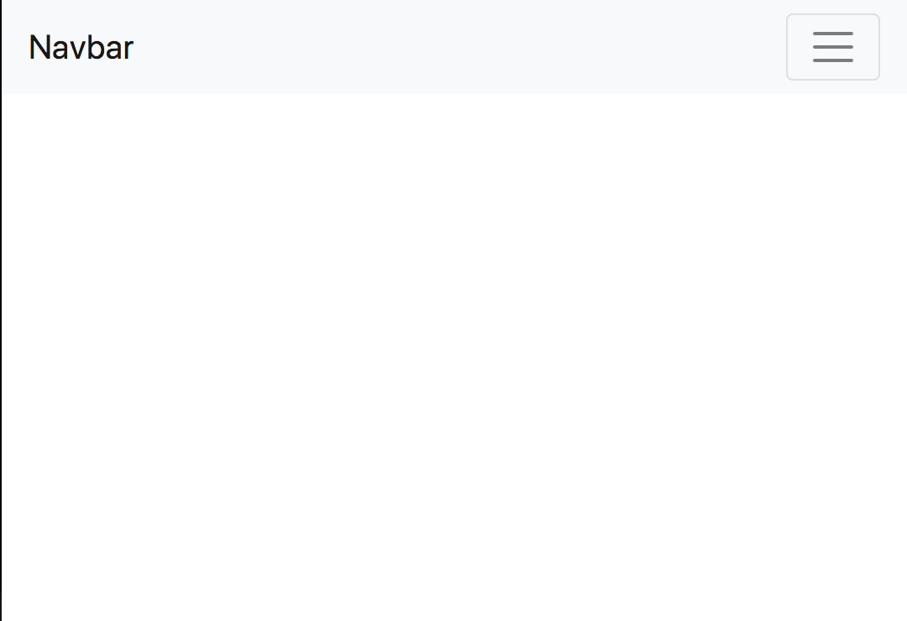
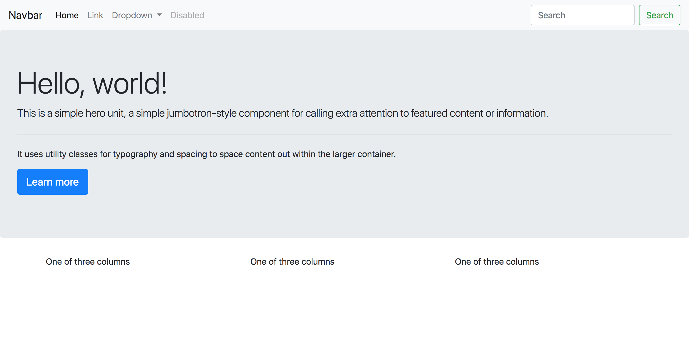
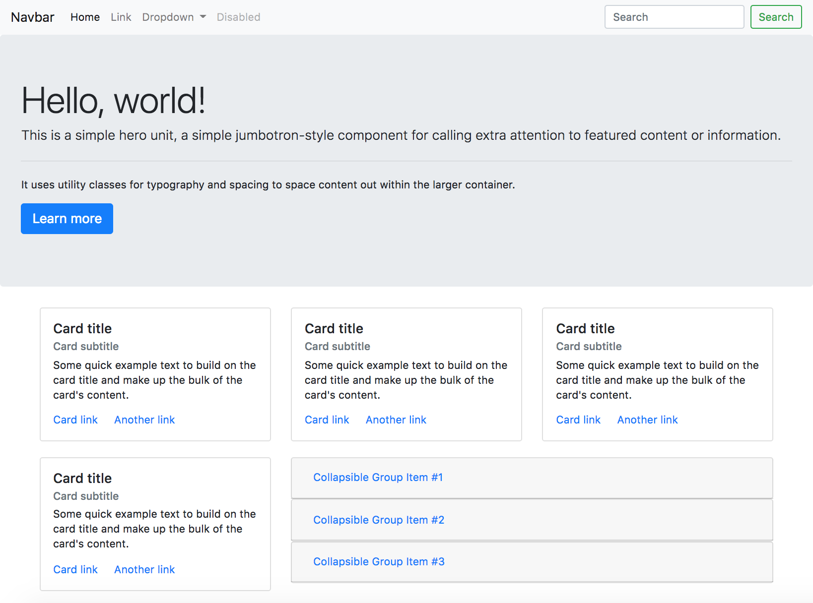
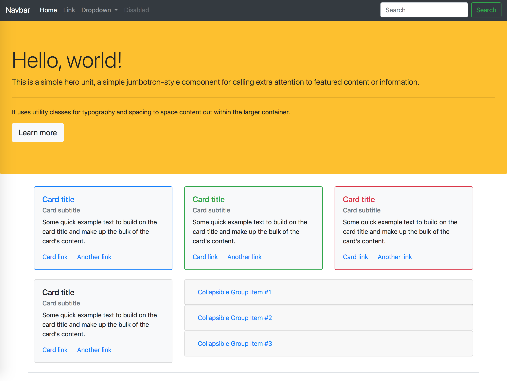

## Bootstrapping your first website!

In this tutorial, we demonstrate the ability of bootstrap to simplify the website design process. We focus on outlining a generic webpage to emphasize the use of pre-made bootstrap components and showcase Bootstrap's intuitive naming schemes and built-in grid system. Bootstrap has many components included, and for the most part, all you have to do is create some divs and give them the correct classes. We'll only use a few, but we hope that in getting some experience with the ones we've chosen, you will be comfortable implementing the other components Bootstrap provides.

Here's what we're going to be creating:



Moving forward, you'll notice "Navigate to:" instructions below many of the following headings. These links are where we'll be pulling relevant code from and are important to the design of our webpage. Even though we'll provide many screenshots along the way, we suggest you navigate to the webpages and copy the code from there. It's not only faster, but it'll be a more realistic experience.

---

## Starting from scratch

### Creating a new directory and .html file

As with any webpage, we'll start off by initializing a directory for our project and creating an `index.html` file. Here's what it looks like on our end, but feel free to name this whatever you want!

```
bootstrap-project
- index.html
```

---

### Linking index.html to Bootstrap

Navigate to: https://getbootstrap.com/docs/4.0/getting-started/introduction/

On this page, you'll find quickstart instructions to using Bootstrap. In particular, we're most interested in the `Starter template`. Copy this code into `index.html`, and you're done. You've now connected your webpage to Bootstrap! Opening `index.html` in a browser should look like this:


Before we move forward, name your webpage by editing the text within the `<title>` tags found in `<head>`, and delete

```html
<h1> Hello, world!</h1>
```

We won't need this moving forward.

---

## Adding Components

On the pages linked below, you'll find instructions on how to implement different components. Each includes several different options and the respective code required to create them. We'll **bold** the options we plan on using and let you know where you can find them.

---

### Navbar

Navigate to: https://getbootstrap.com/docs/4.0/components/navbar/.

To begin, we'll start by adding a navbar to your page. Our website utilizes the **first option**, so copy and paste the associated code and place it directly under the opening `<body>` tag.

Reload your page and it should look like this.



Now try resizing the window. It's already responsive!



---

### Jumbotron

Navigate to: https://getbootstrap.com/docs/4.0/components/jumbotron/

Next, we'll add a Jumbotron, which is Bootstrap's version of a Title area. Here, we also use the **first option**. Copy and paste this code directly below the `navbar` you just created.

```HTML
<body>
  <nav class="navbar navbar-expand-lg navbar-light bg-light">
  <div class="jumbotron">
```


---

### Card

Now things will become a bit more complicated! Lets add three cards to our page, and align them in a row. In order to accomplish this, we'll be using the **Bootstrap grid system**.

The Bootstrap grid system uses flexboxes under the hood to set up websites in a simple, intuitive manner. You can fit the different Bootstrap components into the grid and it should automatically be well formatted and responsive.

Navigate to: https://getbootstrap.com/docs/4.0/layout/grid/.

Copy the **first grid option**, and paste this under the `jumbotron`. Once this is done, reload the page to see the grid you've just created. You're now ready to introduce the cards.



Navigate to: https://getbootstrap.com/docs/4.0/components/card/

We'll be using the card style located directly under the **Titles, text, and links** heading. Copy and paste the associated code into each column and delete the original text (`One of the three columns`).

Note that these comes with a preset width, so remove `style="width: 18rem"` from `<div class="card">`.

Here's what one of these columns should look like after you're done:

```html
<div class="col-sm">
  <div class="card">
    <div class="card-body">
      <h5 class="card-title">Card title</h5>
      <h6 class="card-subtitle mb-2 text-muted">Card subtitle</h6>
      <p class="card-text">Some quick example text to build on the card title and make up the bulk of the card's content.</p>
      <a href="#" class="card-link">Card link</a>
      <a href="#" class="card-link">Another link</a>
    </div>
  </div>
</div>
```


---

### Collapse - Accordion

You can also split up grid system into larger and smaller partitions. In this section, we'll add a single card to the left side of the screen just like we did in the last step, and a larger accordion to its right.

To begin, add a new row into the same container you created when you copied over the original grid. With everything collapsed, the format should look like this:

```html
<div class="container">
  <div class="row">
  <div class="row">
</div>
```

Lets now create two columns within our new row:

```html
<div class="row">
  <div class="col-sm-4"></div>
  <div class="col-sm-8"></div>
</div>
```

Within `<div class="col-sm-4">`, add a card by copying and pasting the relevant code from the `card` component section linked above. If you've forgotten how to do this, refer to the previous section.

Navigate to: https://getbootstrap.com/docs/4.0/components/collapse/

We'll be using the **Accordion** option. Copy and paste the relevant code to `<div class="col-sm-8">`. If you reload your page now, you'll see that the width of the accordian is twice the size of the width of the card.

---

#### A Few Style Changes

Within the grid system, there is no built-in padding on the top or bottom of your rows. Add the class `mb-4` to the `<div class="row">` to create this spacing.

```html
<div class="row mb-4">
```

Upon refresh, the first tab within the accordion also opens automatically. If you don't want this to happen, identify `<div id="collapseOne">` and remove the `show` class. Remember, Bootstrap is all about classes: when you want something changed, you can almost always add/remove a class to make the change.

```html
<div id="collapseOne" class="collapse" aria-labelledby="headingOne" data-parent="#accordion">
  <div class="card-body">
  </div>
</div>
```


---

### Footer

Creating a footer using Bootstrap takes a bit more manual work because there are not pre-made classes. But don't worry - we already have all the tools we need to do this ourselves (aka Bootstrap provides lots of classes that will make this easy)!

Lets begin by creating our footer as a new row within our container. This should look like this:

```html
  <footer class="row border-top pt-4">
```

For aesthetic purposes, we add a border to this, which you can see by the addition of the class `border-top` to our `<footer>`. We further want to add some spacing between this border and the following columns, so we add `pt-4`. As you might have guessed, `pt-4` stands for `padding-top-4`, where the `4` represents the amount of spacing we want.

Lets divide this row into four columns (the same way you did when creating our accordion).

In the first columns, we include the code:

 ```html

<small class="d-block mb-3 text-muted">© 2017-2018</small>
```

Don't worry about finding this code yourself. It just adds a Bootstrap logo and copyright symbol.

For the other three columns, lets add some links similar to what we did in our first lab. Copy and paste this code into each:

```html
  <h5>Link Header</h3>
  <ul class="list-unstyled">
    <li>First</li>
    <li>Second</li>
    <li>Third</li>
  </ul>
```


---

## What we have so far
Wow, in such a short time, we've come so far! At this point, you should have a uniformly styled, aesthetically pleasing website. Often times you will want to expand on this and add your own styling, but this is a great way to quickly prototype and format a website. Here's what we have so far:

- [x] A responsive navbar that becomes a hamburger menu on smaller screens
- [x] A jumbotron header for the website
- [x] A nicely spaced, formatted, and responsive grid containig some cards and an accordian
- [x] A footer as a part of the grid with some final links

In case you got lost along the way, here's a look at our page with all the components collapsed:

```html
<html lang="en">
  <head>
  <body>
  <nav class="navbar navbar-expand-lg navbar-light bg-light">
    <div class="jumbotron">
    <div class="container">
      <div class="row mb-4">
      <div class="row mb-4">
      <footer class="row border-top pt-4">
    </div>
    <!-- Optional JavaScript -->
    <!-- jQuery first, then Popper.js, then Bootstrap JS -->
    <script src="https://code.jquery.com/jquery-3.2.1.slim.min.js" integrity="sha384-KJ3o2DKtIkvYIK3UENzmM7KCkRr/rE9/Qpg6aAZGJwFDMVNA/GpGFF93hXpG5KkN" crossorigin="anonymous"></script>
    <script src="https://cdnjs.cloudflare.com/ajax/libs/popper.js/1.12.9/umd/popper.min.js" integrity="sha384-ApNbgh9B+Y1QKtv3Rn7W3mgPxhU9K/ScQsAP7hUibX39j7fakFPskvXusvfa0b4Q" crossorigin="anonymous"></script>
    <script src="https://maxcdn.bootstrapcdn.com/bootstrap/4.0.0/js/bootstrap.min.js" integrity="sha384-JZR6Spejh4U02d8jOt6vLEHfe/JQGiRRSQQxSfFWpi1MquVdAyjUar5+76PVCmYl" crossorigin="anonymous"></script>
  </body>
  </html>
```

---

## Additional Challenges
Congratulations! We finished early. Lets look at the styling section and check out some options there! There's also some notes on implementing carousels and notes on JavaScript below.

---

### Styling

Navigate to: https://getbootstrap.com/docs/4.0/utilities/

Here, you'll find lots of styling options to add some personality to your page. Maybe a few ideas? You have all of these components already!

```HTML
<nav class="navbar navbar-expand-lg navbar-dark bg-dark">

<div class="jumbotron bg-warning">

<div class="card border border-primary bg-light">

<h5 class="card-title text-primary">Card title</h5>

<div class="card border border-success bg-light">

<h5 class="card-title text-success">Card title</h5>

<div class="card border border-danger bg-light">

<h5 class="card-title text-danger">Card title</h5>
```

Look at what we made with a few simple classes:


---

### Carousel

Navigate to: https://getbootstrap.com/docs/4.0/components/carousel/

Let's try replacing the `jumbotron` with a `carousel`. Particularly, we're interested in using the option under **With Controls**.

If you thought all we had to do was copy and paste, you were right. Copy the relevant code and replace the code associated with the `jumbotron` we created earlier.

Finally, we'll need to add some images. Here are same sample URLs, but feel free to find your own!

1: https://www.dartmouth.edu/~dartmouthdirect/wp-content/uploads/Dartmouth-Hall.jpeg   

2: https://www.library.dartmouth.edu/sites/default/files/media-images/dartmouth-library-tower-room-students-v2.jpg   

3: http://www.dartreview.com/wp-content/uploads/2015/01/Baker_Winter_0.jpg

---

### JavaScript

As we haven't fully covered Javascript yet, we chose to stick mostly to the CSS component part of Bootstrap. Bootstrap also, however, provides some fun javascript functionality as well such as [Scrollspy](https://getbootstrap.com/docs/4.0/components/scrollspy/) and [Modals](https://getbootstrap.com/docs/4.0/components/modal/).

---
